## Instance Segmentation with a Discriminative Loss Function

Tensorflow implementation of [Semantic Instance Segmentation with a Discriminative Loss Function](https://arxiv.org/abs/1708.02551) trained on the [TuSimple dataset](http://benchmark.tusimple.ai/#/t/1)

---
### Files
├── __data__ here the data should be stored  
│&nbsp;&nbsp;&nbsp;&nbsp;&nbsp;   └── __tusimple_dataset_processing.py__ processes the TuSimple dataset  
├── __doc__ documentation  
├── __inference_test__ inference related data  
│&nbsp;&nbsp;&nbsp;&nbsp;&nbsp;   └── __images__ for testing the inference    
├── __trained_model__  pretrained model for finetuning  
├── __clustering.py__ mean-shift clustering  
├── __datagenerator.py__ feeds data for training and evaluation  
├── __enet.py__ [Enet architecture](https://github.com/kwotsin/TensorFlow-ENet)  
├── __inference.py__ tests inference on images  
├── __loss.py__ defines discriminative loss function  
├── __README.md__  
├── __training.py__ contains training pipeline  
├── __utils.py__ contains utilities files for building and initializing the graph  
└── __visualization.py__ contains visualization of the clustering and pixel embeddings  

### Instructions

#### Inference
1. To test the inference of the trained model execute:  
`python inference.py --modeldir trained_model --outdir inference_test/results`  

#### Training

1. Download the [TuSimple training dataset](http://benchmark.tusimple.ai/#/t/1) and extract its contents to the `data` folder. The folder structure should look like this:  
| data  
├── train_set  
│&nbsp;&nbsp;&nbsp;&nbsp;&nbsp;├── clips  
│&nbsp;&nbsp;&nbsp;&nbsp;&nbsp;├── label_data_0313.json  
│&nbsp;&nbsp;&nbsp;&nbsp;&nbsp;├── label_data_0531.json  
│&nbsp;&nbsp;&nbsp;&nbsp;&nbsp;├── label_data_0601.json  
│&nbsp;&nbsp;&nbsp;&nbsp;&nbsp;└── readme.md
2. Run the following script to prepare images and labels.  
`python data/tusimple_dataset_processing.py <train_data_dir>`  
This should create the following images and labels folders:  
| data  
├── train_set  
├── images  
└── labels  
3. For training on the dataset execute:  
`python training.py`  
alternatively use optional parameters (default parameters in this example):   
`python training --srcdir data --modeldir pretrained_semantic_model --outdir saved_model --logdir log --epochs 50 --var 1.0 --dist 1.0 --reg 1.0 --dvar 0.5 --ddist 1.5
`
4. To test the trained network execute:
`python inference.py --modeldir saved_model`

### Training Pipeline
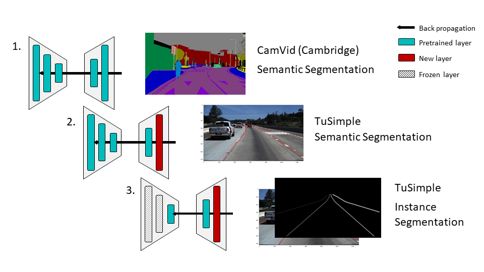

### Training Visualization
Feature space projection of one image for consecutive gradient steps. Each point represents one pixel embedding and each color represents an instance in the label.

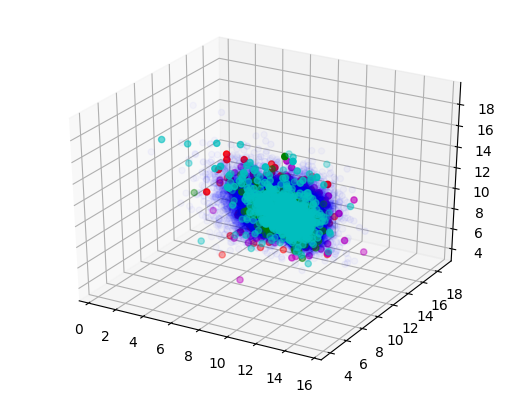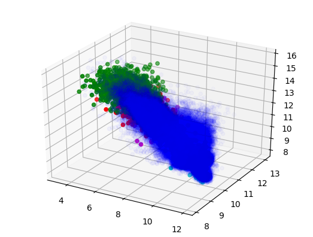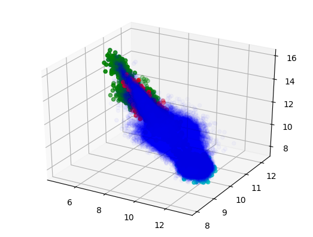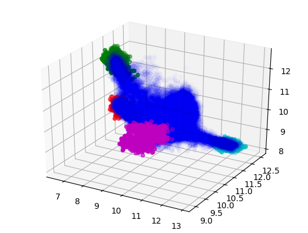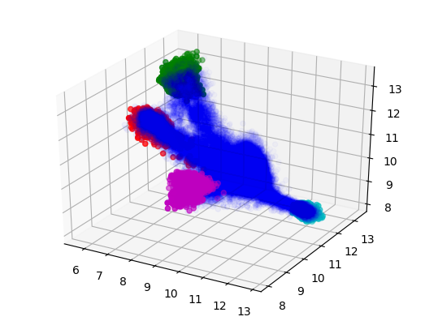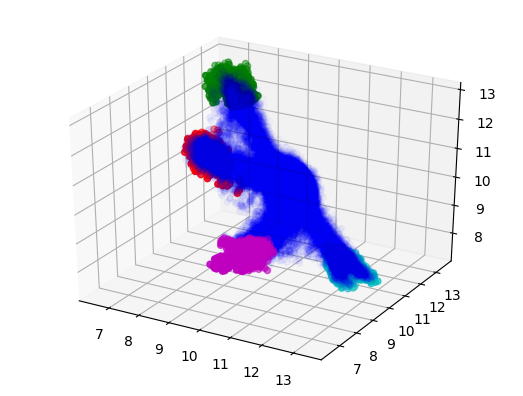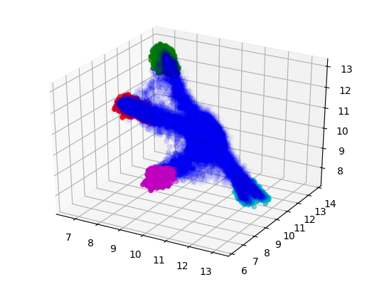

### Results
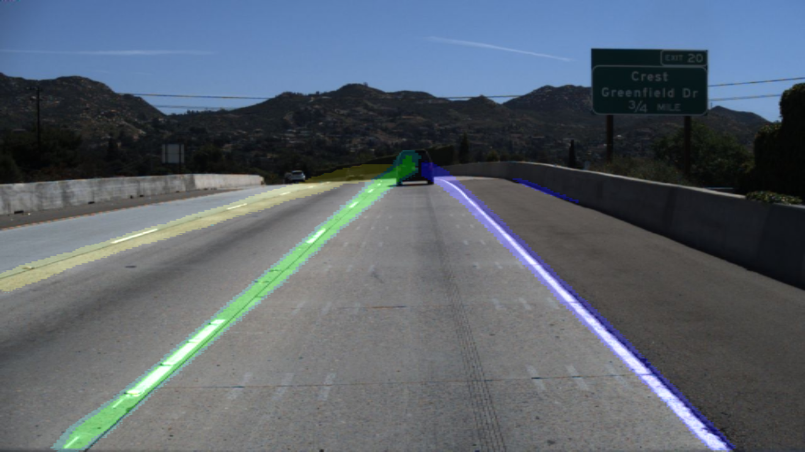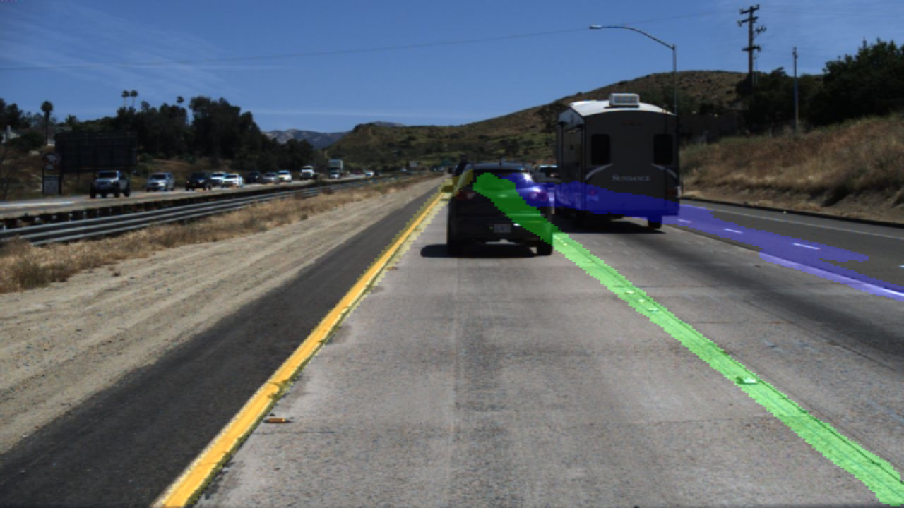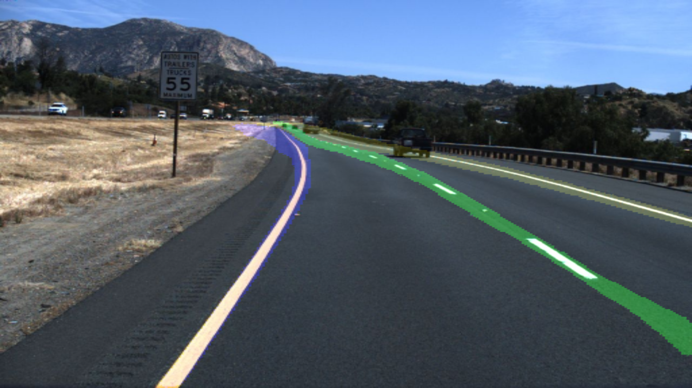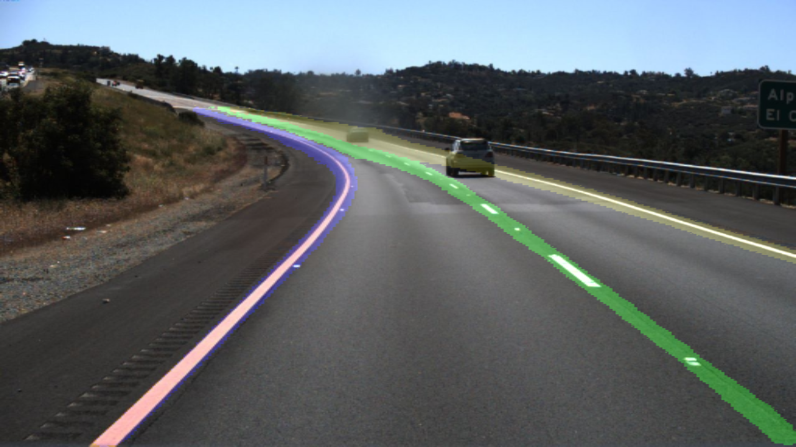

### Todo
- pip requirements
- semantic segmentation code
- visualization

Tensorflow version 1.2

### Reference and Credits
This application uses Open Source components. We acknowledge and are grateful to these developers for their contributions to open source:
- Project: TensorFlow-ENet https://github.com/kwotsin/TensorFlow-ENet  
- Project: TuSimple dataset http://benchmark.tusimple.ai
- Project: Fast Scene Understanding https://github.com/DavyNeven/fastSceneUnderstanding

### Related work
- Paper: [Towards End-to-End Lane Detection: an Instance Segmentation Approach](https://arxiv.org/abs/1802.05591)
